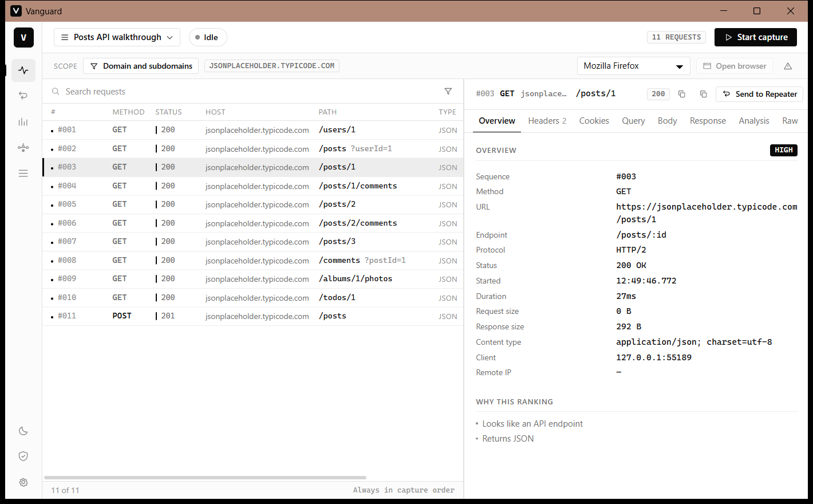

# Vanguard

Desktop HTTP/HTTPS traffic inspector built for crawler engineering.

Vanguard captures the traffic an application makes, keeps it in the order it
happened, and helps answer the question that matters when you are writing a
scraper: **which of these requests do I actually need?**

```
CAPTURE → TIMELINE → INSPECT → ANALYSE → REPEATER → COMPARE → CRAWLER LOGIC
```



---

## What it does

**Capture**
- Local HTTP and HTTPS proxy with a generated CA for TLS interception
- Scope filtering by domain, subdomain, exact host, path glob, method and content type
- Out-of-scope traffic is proxied normally, counted, and kept out of the timeline
- Chronological timeline with a `sequence_id` assigned at capture time — never re-sorted
- Sessions, each with its own requests, cookies, drafts and analysis

**Inspect**
- Overview, headers, cookies, query, request body, response, analysis and raw views
- JSON viewer with collapse, key filtering, copy value and copy JSONPath
- Sensitive headers and cookies masked by default, revealable per row
- Large bodies are not loaded until you ask; bodies over the cap are never stored

**Analyse**
- Endpoint normalisation (`/api/product/123` → `/api/product/:id`), original URL always kept
- Token detection: Bearer, JWT, API keys, CSRF, session and correlation ids
- Cookie timeline: which exchange set a cookie and which ones sent it back
- Relationship detection: a value produced by one response reappearing in a later request
- Request importance (high / medium / low) with the reasons shown
- Flow graph of the detected relationships

**Repeater**
- Send any capture to an editable draft — the capture itself is never modified
- Edit method, URL, query, headers, cookies and body
- Replay once or N times, sequential or concurrent, with a delay between calls
- Full replay history, each with its own request snapshot
- Response comparison with a JSON-aware diff that flags likely-volatile fields

**Interop**
- HAR import and export
- Copy as cURL, with optional secret masking

---

## Privacy

Everything stays on your machine. There is no telemetry and nothing is sent
anywhere. Captured data lives in a local SQLite database plus a blob directory.

The CA private key is generated locally and never leaves the machine. Installing
a CA into your system trust store is a real security decision: Vanguard always
shows the exact command it will run and asks first. Remove it when you are done.

---

## Getting started

1. **Generate and install the CA** — Certificate screen. The install button runs
   `certutil -addstore -f Root` on Windows or copies into the system anchor
   directory on Linux, with an explicit elevation prompt. Nothing happens silently.
2. **Create a session** and optionally narrow the scope to the domains you care about.
3. **Start the capture.** The proxy listens on `127.0.0.1:8080` by default.
4. **Open a browser** from the toolbar. Vanguard launches an isolated profile
   pointed at the proxy — your system proxy settings are never touched.
5. Browse, then read the timeline.

### Browsers

| Browser | How it is pointed at the proxy | CA trust |
|---|---|---|
| Chrome, Edge, Brave, Chromium | `--proxy-server` with a dedicated `--user-data-dir` | System trust store |
| Firefox (Windows, macOS) | Dedicated profile with `network.proxy.*` prefs | System trust store, via `security.enterprise_roots.enabled` |
| Firefox (Linux) | Dedicated profile with `network.proxy.*` prefs | Own NSS store — Vanguard imports the CA with `certutil` when `nss-tools` / `libnss3-tools` is installed |

Firefox ignores Chromium's `--proxy-server` flag, so Vanguard writes a `user.js`
into a throwaway profile instead. Your normal Firefox profile is left alone.

You can also point anything else at `127.0.0.1:8080` by hand — curl, a script,
a mobile device on the same network.

---

## Building

Requires [Rust](https://rustup.rs) 1.86+ and Node.js 20+.

```bash
npm install
npm run app:dev      # development, with hot reload
npm run app:build    # release build and installers
```

Output:

| Platform | Artifacts |
|---|---|
| Windows | `src-tauri/target/release/vanguard.exe`, NSIS installer under `target/release/bundle/nsis/` |
| Linux | `vanguard` binary, plus `.deb`, `.rpm` and `.AppImage` under `target/release/bundle/` |

The bundle targets are configured in `src-tauri/tauri.conf.json`. macOS and ARM
targets are not built by default but nothing in the code is platform-locked.

### Linux build dependencies

Debian / Ubuntu:

```bash
sudo apt install libwebkit2gtk-4.1-dev build-essential curl wget file libxdo-dev libssl-dev libayatana-appindicator3-dev librsvg2-dev
```

Arch:

```bash
sudo pacman -S webkit2gtk-4.1 base-devel curl wget file openssl appmenu-gtk-module libappindicator-gtk3 librsvg
```

Fedora:

```bash
sudo dnf install webkit2gtk4.1-devel openssl-devel curl wget file libappindicator-gtk3-devel librsvg2-devel
```

For Firefox CA trust on Linux, also install `libnss3-tools` (Debian/Ubuntu) or
`nss-tools` (Fedora/Arch).

The shipped build needs no Python, Node.js, Rust, Go or Java at runtime.

---

## Tests

```bash
cd src-tauri
cargo test                              # unit + integration
cargo test --test https_mitm -- --ignored   # real HTTPS interception, needs network
cargo run --example browser_check -- firefox 25   # launch a browser and watch what it captures
```

The integration tests drive the real proxy: they start it, push traffic through
it, and assert on what landed in the database — capture order, endpoint
normalisation, cookie attribution, scope filtering, and replay behaviour.

---

## Architecture

```
┌──────────────────────────────────────┐
│ React + TypeScript (Vite)            │
│ Timeline · Inspector · Repeater      │
│ Analysis · Flow graph                │
└──────────────────┬───────────────────┘
                   │ Tauri commands + events
┌──────────────────▼───────────────────┐
│ Rust core                            │
│ proxy · capture · analyzer           │
│ repeater · storage · tls             │
└──────────────────┬───────────────────┘
                   ▼
              SQLite + blobs
```

Capture never blocks on the database. The proxy handler pushes into an unbounded
queue; a single writer task persists and only then emits the event that puts the
row on the timeline.

```
network → capture engine → queue → persistence → event bus → frontend
```

TLS, HTTP/2 and certificate generation come from mature crates
([hudsucker](https://crates.io/crates/hudsucker), rustls, rcgen). No cryptography
is implemented here.

### Layout

```
src/                       React app
  app/                     shell, rail, topbar
  components/              ui, timeline, inspector, viewers, layout
  pages/                   capture, repeater, analysis, flow, sessions, ca, settings
  stores/                  zustand stores
  i18n/                    en and pt-BR dictionaries
src-tauri/src/
  proxy/                   scope, MITM handler, server, browser launchers
  capture/                 engine, write queue, HAR import
  analyzer/                endpoints, ids, tokens, relations, graph, importance
  repeater/                drafts, execution, replay, comparison
  storage/                 schema, sessions, requests, cookies, drafts, blobs
  tls/                     CA generation and trust-store install
  commands/                Tauri command surface
```

Every file is kept under 400 lines.

---

## Design principles

1. **Order matters.** The timeline is capture order. It is never re-sorted by
   URL, status, domain or duration.
2. **The capture is immutable.** Replays are copies. The original row is never
   touched.
3. **You should be able to isolate the site.** Scope filtering exists so you are
   not staring at analytics and CDN noise.
4. **Analysis is honest.** Relationship detection is a heuristic over repeated
   values. The UI says so rather than presenting guesses as facts.
5. **Local-first.** No cloud, no telemetry, no exceptions.

---

## Language

The interface ships in English and can be switched to Português (BR) in Settings.

---

## Disclaimer

Use Vanguard for debugging, development, testing and analysis of applications
and traffic you are authorised to inspect.

Do not assume a captured request may be replayed indefinitely or against any
service. Multiple and concurrent replay are capped and opt-in, but respecting a
service's limits and rules is your responsibility.

---

## License

To be defined.
